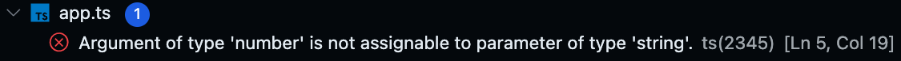

# Typescript

## Getting Started

1. **Install Node.js and npm**

   Before you can start a TypeScript project, you need to have Node.js and npm
   (Node Package Manager) installed on your computer. If you do not, you can
   download them from the [official website](https://nodejs.org/en). A download
   of Node.js comes with npm without needing a separate download.

2. **Initialize a new npm project**

   ```bash
   npm init -y
   ```

3. **Install Typescript**

   a. **Globally (optional, but recommended)**

   You can install TypeScript globally on your system to access the TypeScript
   compiler (tsc) from the command line:

   ```bash
   npm install -g typescript
   ```

   b. **As a project dependency**

   Alternatively, you can install it as a local dependency to your project.

   ```bash
   npm install typescript --save-dev
   ```

4. **Create a Typescript configuration file (tsconfig.json)**

   The TypeScript compiler uses a configuration file to understand how to
   compile your TypeScript code. You can create this configuration file manually
   or use TypeScript's interactive setup:

   ```bash
   npx tsc --init
   ```

   This command will generate a tsconfig.json file in your project directory.
   We will revisit this file later.

5. **Make a TypeScript file**

   Now you're ready to start writing TypeScript code in your project directory.
   Create a TypeScript file with the .ts extension, for example, `app.ts`.

## Understanding Static Typing

TypeScript is a statically typed superset of JavaScript.

In JavaScript, you declare variables without specifying their types and the type
is determined dynamically at runtime. For example:

```js
let x = 10;
```

TypeScript, on the other hand, allows you to specify the type of a variable when
you declare it. This means you explicitly tell the TypeScript compiler what kind
of data a variable will hold, and it checks that you're using it correctly
throughout your code.

```ts
let x: number = 10; // x can only hold numbers
```

TypeScript includes most of the data types that you find in regular JavaScript,
but it also introduces additional data types to provide better type checking and
annotations. For a full list of available types, see the
[docs](https://www.typescriptlang.org/docs/handbook/2/everyday-types.html).

## Building A TypeScript File

1. Open the `app.ts` file you made earlier and add the following code:

   ```ts
   function greet(name) {
     return `Hello, ${name}!`;
   }

   console.log(greet("John"));
   ```

2. Next, run the Typescript compiler to turn this code into JavaScript.

   ```bash
   tsc app.ts
   ```

   You should notice a new `app.js` file appear. Take a look in this file. Does
   anything look different?

3. Pat yourself on the back. You just compiled your first TypeScript file!

## Hey Wait That Was Just JavaScript

You probably noticed that the code we added to `app.ts` was no different than
ordinary JavaScript code. And yet, it still considered valid by the TypeScript
compiler. What gives?

TypeScript is designed to be a **superset** of JavaScript, which means that any
valid JavaScript code is also valid TypeScript code. TypeScript extends
JavaScript by adding static typing and additional features, but it does not
remove or change any existing JavaScript features or syntax.

If you wanted, you could take an existing JavaScript file (with a .js
extension), rename it to have a .ts extension, and it would work as TypeScript
without modification. TypeScript will treat it as having the `any` type for all
variables and expressions, effectively opting out of static type checking for
that code.

However, to take full advantage of TypeScript's benefits, you can gradually add
type annotations to your JavaScript code. By doing so, you can enhance code
readability and catch type-related errors at compile time, even in existing
JavaScript files.

Let's do that now. Modify your app.ts file to include static type checking, like
so:

```ts
function greet(name: string) {
  return `Hello, ${name}!`;
}

console.log(greet("John"));
```

Compile the file again and take a look at `app.js`. You'll notice that it still
looks the same. So what's the point?

Change the value `"John"` in the console.log function to the number `5`. You
will see that VSCode is quick to point out the problem you've just introduced to
your code. The types don't match! The parameter `name` was expecting to receive
a string argument, but it got a number instead.



If you try to compile this code, the compiler will yell at you as well.


**This** is the power of TypeScript. Static typing is added to your JavaScript
code so that you can avoid type-related errors.\
Your code is now more explicit and predictable. 🎉🎉

## Interfaces
