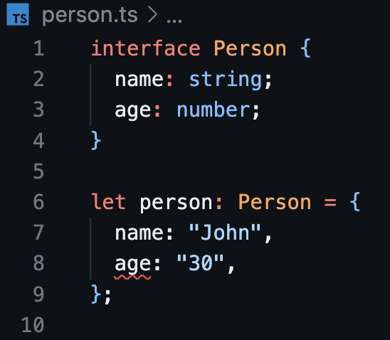

# TypeScript

## Getting started

1. **Install Node.js and npm**

   Before you can start a TypeScript project, you need to have Node.js and npm
   (Node Package Manager) installed on your computer. If you do not, you can
   download them from the [official website](https://nodejs.org/en). A download
   of Node.js comes with npm without needing a separate download.

2. **Initialize a new npm project**

   ```bash
   npm init -y
   ```

3. **Install Typescript**

   a. **Globally (optional, but recommended)**

   You can install TypeScript globally on your system to access the TypeScript
   compiler (tsc) from the command line:

   ```bash
   npm install -g typescript
   ```

   b. **As a project dependency**

   Alternatively, you can install it as a local dependency to your project.

   ```bash
   npm install typescript --save-dev
   ```

4. **Create a Typescript configuration file (tsconfig.json)**

   The TypeScript compiler uses a configuration file to understand how to
   compile your TypeScript code. You can create this configuration file manually
   or use TypeScript's interactive setup:

   ```bash
   npx tsc --init
   ```

   This command will generate a tsconfig.json file in your project directory.
   We will revisit this file later.

5. **Make a TypeScript file**

   Now you're ready to start writing TypeScript code in your project directory.
   Create a TypeScript file with the .ts extension, for example, `app.ts`.

## Understanding static typing

TypeScript is a statically typed superset of JavaScript.

In JavaScript, you declare variables without specifying their types and the type
is determined dynamically at runtime. For example:

```js
let x = 10;
```

TypeScript, on the other hand, allows you to specify the type of a variable when
you declare it. This means you explicitly tell the TypeScript compiler what kind
of data a variable will hold, and it checks that you're using it correctly
throughout your code.

```ts
let x: number = 10; // x can only hold numbers
```

TypeScript includes most of the data types that you find in regular JavaScript,
but it also introduces additional data types to provide better type checking and
annotations. For a full list of available types, see the
[docs](https://www.typescriptlang.org/docs/handbook/2/everyday-types.html).

## Building a TypeScript file

1. Open the `app.ts` file you made earlier and add the following code:

   ```ts
   function greet(name) {
     return `Hello, ${name}!`;
   }

   console.log(greet("John"));
   ```

2. Next, run the Typescript compiler to turn this code into JavaScript.

   ```bash
   tsc app.ts
   ```

   You should notice a new `app.js` file appear. Take a look in this file. Does
   anything look different?

3. Pat yourself on the back. You just compiled your first TypeScript file!

## Hey wait that was just JavaScript

You probably noticed that the code we added to `app.ts` was no different than
ordinary JavaScript code. And yet, it still considered valid by the TypeScript
compiler. What gives?

TypeScript is designed to be a **superset** of JavaScript, which means that any
valid JavaScript code is also valid TypeScript code. TypeScript extends
JavaScript by adding static typing and additional features, but it does not
remove or change any existing JavaScript features or syntax.

If you wanted, you could take an existing JavaScript file (with a .js
extension), rename it to have a .ts extension, and it would work as TypeScript
without modification. TypeScript will treat it as having the `any` type for all
variables and expressions, effectively opting out of static type checking for
that code.

However, to take full advantage of TypeScript's benefits, you can gradually add
type annotations to your JavaScript code. By doing so, you can enhance code
readability and catch type-related errors at compile time, even in existing
JavaScript files.

Let's do that now. Modify your app.ts file to include static type checking, like
so:

```ts
function greet(name: string) {
  return `Hello, ${name}!`;
}

console.log(greet("John"));
```

Compile the file again and take a look at `app.js`. You'll notice that it still
looks the same. So what's the point?

Change the value `"John"` in the console.log function to the number `5`. You
will see that VSCode is quick to point out the problem you've just introduced to
your code. The types don't match! The parameter `name` was expecting to receive
a string argument, but it got a number instead.


If you try to compile this code, the compiler will yell at you as well.


**This** is the power of TypeScript. Static typing is added to your JavaScript
code so that you can avoid type-related errors.\
Your code is now more explicit and predictable. 🎉🎉

## Interfaces

Interfaces define the structure of **objects**, which can be used to describe
the shape of classes, function parameters, and object literals.

### Declaring interfaces

You declare an interface using the _interface_ keyword, followed by the
interface name and a set of properties or method signatures enclosed in curly
braces. For example:

```ts
interface Person {
  name: string;
  age: number;
}
```

Here, we've declared an interface named Person with two properties: name of type
_string_ and age of type _number_.

### Using interfaces

You can use interfaces to define the shape of objects, and TypeScript will check
that objects conform to the interface's structure. Using the interface we just
declared as an example:

```ts
let person: Person = {
  name: "John",
  age: 30,
};
```

Here the person object must have both name and age properties of the correct
types to satisfy the Person interface. You can try this out by putting the
interface and person variables in a `person.ts` file. If we change the value of
age from `30` to `"30"` we can see this error.




### Optional properties

You can make properties optional in an interface by adding a `?` after the
property name:

```ts
interface Person {
  name: string;
  age?: number;
}
```

With age marked as optional, an object can have or omit the age property when
implementing the Person interface.

### Readonly properties

You can mark properties as readonly, meaning they can't be modified once
assigned:

```ts
interface Point {
  readonly x: number;
  readonly y: number;
}

let point: Point = { x: 0, y: 0 };
// point.x = 10;
// Error: Cannot assign to 'x' because it is a read-only property.
```

### Function signatures

Interfaces can also describe function signatures. For example, you can define an
interface for a function that takes two numbers and returns a number:

```ts
interface MathFunction {
  (x: number, y: number): number;
}

let add: MathFunction = function (a, b) {
  return a + b;
};
```

### Extending interfaces

You can extend interfaces by using the `extends` keyword to create a new
interface that inherits properties and methods from one or more existing
interfaces. For example, if we wanted to have an `Employee` interface that
contianed `name`, `age`, and `employeeId` properties, we may notice that we have
already defined an interface that includes `name` and `age`. We could extend our
`Employee` interface off of our `Person` interface and avoid repetition.

```ts
interface Employee extends Person {
  employeeId: number;
}

let employee: Employee = {
  name: "Alice",
  age: 25,
  employeeId: 12345,
};
```

In this example, Employee extends Person, inheriting the name and age
properties.

### Implementing interfaces with classes

You can `implement` an interface in a class by ensuring the class provides
implementations for all the properties and methods declared in the interface:

```ts
class Student implements Person {
  constructor(public name: string, public age: number) {}
}

let student: Student = new Student("Bob", 21);
```

### Function interfaces and call signatures

You can also use interfaces to describe the shape of functions. This is
particularly useful when defining callback functions or higher-order functions:

```ts
interface OnClick {
  (event: MouseEvent): void;
}

function registerClickHandler(callback: OnClick) {
  // ...
}
```

### Index signatures

Interfaces can define index signatures for objects with dynamic property names:

```ts
interface Dictionary {
  [key: string]: string;
}

let colors: Dictionary = {
  red: "#FF0000",
  green: "#00FF00",
  blue: "#0000FF",
};
```

This allows you to create objects with arbitrary property names and values of a
specific type.

## Functions

### Declaring functions

We saw a basic function declaration earlier when we made the `greet` function.
Here is another basic function declaration:

```ts
function add(x: number, y: number): number {
  return x + y;
}
```

In this example, add is a function that takes two parameters (x and y) of type
number and returns a value of type number.

### Optional parameters

Like with interfaces, we can use the `?` character to make a parameter optional.
You add it after the parameter name in the parameter list:

```ts
function greet(name: string, greeting?: string): string {
  if (greeting) {
    return `${greeting}, ${name}!`;
  } else {
    return `Hello, ${name}!`;
  }
}
```

In the above example, the greeting parameter is optional. You can call
greet("John") without providing a greeting, and it will default to "Hello."

Try running this yourself by modifying your `app.ts` file.

### Default parameters

You can provide default values for function parameters:

```ts
function greet(name: string, greeting: string = "Hello"): string {
  return `${greeting}, ${name}!`;
}
```

If you don't provide a greeting when calling greet("John"), it will use the
default value of "Hello."

### Rest parameters

You can use rest parameters to capture a variable number of arguments into an
array:

```ts
function sum(...numbers: number[]): number {
  return numbers.reduce((total, num) => total + num, 0);
}

const result = sum(1, 2, 3, 4, 5); // Result is 15
```

In this example, the ...numbers syntax allows you to pass any number of
arguments to the sum function, and they will be collected into the numbers
array.

### Function overloading

You can define multiple function signatures for the same function using function
overloading. TypeScript will select the appropriate signature based on the
number and types of arguments provided:

```ts
function combine(a: string, b: string): string;
function combine(a: number, b: number): number;
function combine(a: any, b: any): any {
  return a + b;
}

const result1 = combine("Hello, ", "world!"); // Result is "Hello, world!"
const result2 = combine(5, 10); // Result is 15
```

In this example, combine is overloaded to handle both string and number
arguments.

### Arrow functions

Arrow functions are made similarly to regular functions:

```ts
const add = (x: number, y: number): number => x + y;
```

### Function types

Functions themselves can have types in TypeScript. We saw something similar in
the `Function signatures` subheading of `interfaces`. For example, you can
define a type for a function that takes two numbers and returns a number:

```ts
type MathOperation = (x: number, y: number) => number;

const add: MathOperation = (x, y) => x + y;
```

### Callback functions

Callback functions are commonly used in asynchronous code. You can define the
types of callback functions to ensure they match expectations:

```ts
function fetchData(url: string, callback: (data: any) => void) {
  // Fetch data and call the callback with the result
}
```

## Generics

Sometimes we want a function or component to be able to accept all types of
input. One option would be to use the `any` type, like so:

```ts
function identity(arg: any): any {
  return arg;
}
```

However, by using the `any` type to allow for all inputs, you can see that we
have no way of knowing what type the actual input or output is when the
function is actually used. This is where generics come into play.

### Generic functions

You can create generic functions by using angle brackets, `<>`, to declare a
type parameter.

Generics allow us to capture the type of the argument in such a way that we can
also use it to denote what is being returned. You can create generic functions
by using angle brackets, `<>`, to declare a type parameter.

```ts
function identity<T>(arg: T): T {
  return arg;
}
```

This type allows us to capture the type the user provides (e.g. number), so that
we can use that information later. We can see here that the same type is used
for the argument and the return type. This allows us to escort that type
information in one side of the function and out the other.

```ts
const str = identity("Hello"); // str is of type string
const num = identity(42); // num is of type number
```

### Using multiple type parameters

You can use multiple type parameters in a generic function:

```ts
function pair<T, U>(first: T, second: U): [T, U] {
  return [first, second];
}

const result = pair("one", 1); // result is of type [string, number]
```

In this example, pair takes two type parameters T and U and returns an array
containing values of those types.

### Generic interfaces

You can also use generics with interfaces to define flexible contracts for
objects:

```ts
interface KeyValuePair<K, V> {
  key: K;
  value: V;
}

const pair: KeyValuePair<string, number> = { key: "age", value: 30 };
```

Here, KeyValuePair is an interface with two type parameters, K for the key type
and V for the value type.

## Type Assertion

Type assertion in TypeScript is a way to tell the TypeScript compiler that you
know more about the type of a value than it can infer on its own. It allows you
to override the default type inference and treat a value as a specific type.
Type assertions are particularly useful when working with situations where
TypeScript's type inference might be too broad or when interfacing with external
libraries that don't provide type information.

### Syntax

Type assertion can be done in two ways:

Using the as keyword:

```ts
let value: any = "hello";
let length: number = (value as string).length;
```

Using angle brackets (<>):

```ts
let value: any = "hello";
let length: number = (<string>value).length;
```

Both forms are equivalent and serve the same purpose.

### When to use type assertion

Type assertion should be used with caution, as it bypasses TypeScript's type
checking. It's generally recommended to use type assertions when:

- You're confident that the type you're asserting is correct.
- You're working with external libraries that lack type definitions (e.g., when
  using JavaScript libraries).
- TypeScript's type inference is too broad, and you need to narrow it down for a
  specific use case.

## TypeScript meets JSX

TypeScript with JSX (JavaScript XML) is a powerful combination, especially when
working with libraries like React for building user interfaces. JSX allows you
to write HTML-like code within your JavaScript/TypeScript code, and TypeScript
provides type safety for JSX elements.

### Enabling JSX in TypeScript

To use JSX in TypeScript, you need to set the jsx compiler option in your
tsconfig.json file to either "react" or "preserve":

```json
{
  "compilerOptions": {
    "jsx": "react"
  }
}
```

- "react" mode enables TypeScript to parse and type-check JSX expressions.
- "preserve" mode treats JSX as compatible with React but doesn't perform
  additional checks.

As a side note, in TypeScript, JSX files typically use the .tsx file extension.
This helps TypeScript identify files that contain JSX syntax and apply the
correct type checking.

### JSX elements

TypeScript provides type safety for JSX elements. When you use JSX in
TypeScript, it infers and checks the types of JSX elements and their attributes.
For instance:

```tsx
const name: string = "John";
const element = <div>Hello, {name}!</div>;
```

TypeScript will ensure that the name variable is of type string, and you can use
it within the JSX element.

### Type assertion in JSX

You can use type assertions (e.g., (value as Type)) in JSX, just like in regular
TypeScript. This can be helpful when working with dynamic data or integrating
with libraries that might not have type definitions.

```tsx
const dynamicValue: any = "Hello, World!";
const element = <div>{dynamicValue as string}</div>;
```

### Props and components

In React and other component-based libraries, you can define components with
props (short for properties). TypeScript helps you define and use props with the
correct types:

```tsx
interface GreetingProps {
  name: string;
}

function Greeting(props: GreetingProps) {
  return <div>Hello, {props.name}!</div>;
}

const element = <Greeting name="John" />;
```

Here, the Greeting component accepts name as a prop of type string, and
TypeScript ensures that the name prop is provided and of the correct type when
using the component.

### Event handling

TypeScript can provide type safety for event handling in JSX:

```tsx
function handleClick(event: React.MouseEvent<HTMLButtonElement>) {
  console.log("Button clicked!");
}

const element = <button onClick={handleClick}>Click me</button>;
```

In this example, TypeScript ensures that the onClick handler is compatible with
the onClick event of a button element.
